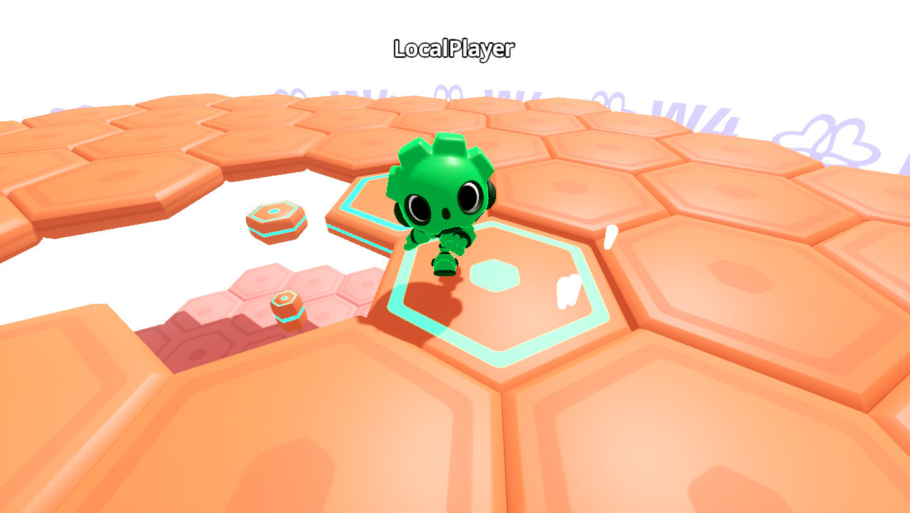

# W4 Cloud's Hexagon demo

This repository contains the Godot project files for the [W4 Cloud Getting Started series](https://w4games.gitlab.io/sdk/w4gd-docs/tutorials/getting_started/index.html).

It offers a complete 3D online multiplayer game demo inspired by Fall Guys' Hex-A-Gon. The game is designed to run with W4 Cloud's authoritative servers and the source project comes with thoroughly commented code.

You can find the corresponding tutorial series in the [W4 Cloud documentation](https://w4games.gitlab.io/sdk/w4gd-docs/index.html)

## Building the start project for the tutorial series

This repository comes with a utility script to generate the docs' series starter project from the completed project, to help with future maintenance.

To build the starter project, please run `./run.sh generate:all`

The program `run.sh` is designed to run on Linux and provides some facilities to build and zip releases, as well as running multiple instances of the game with a mock W4 class that allows testing locally. Run `run.sh help` to get information on how the script works.
